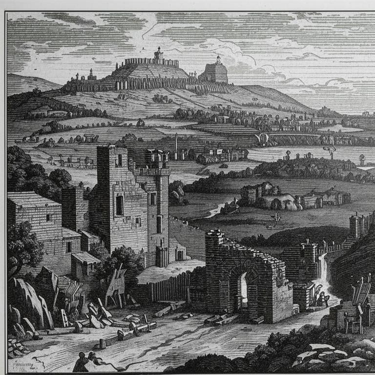
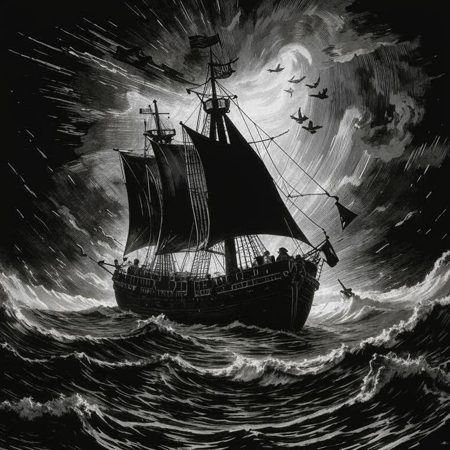
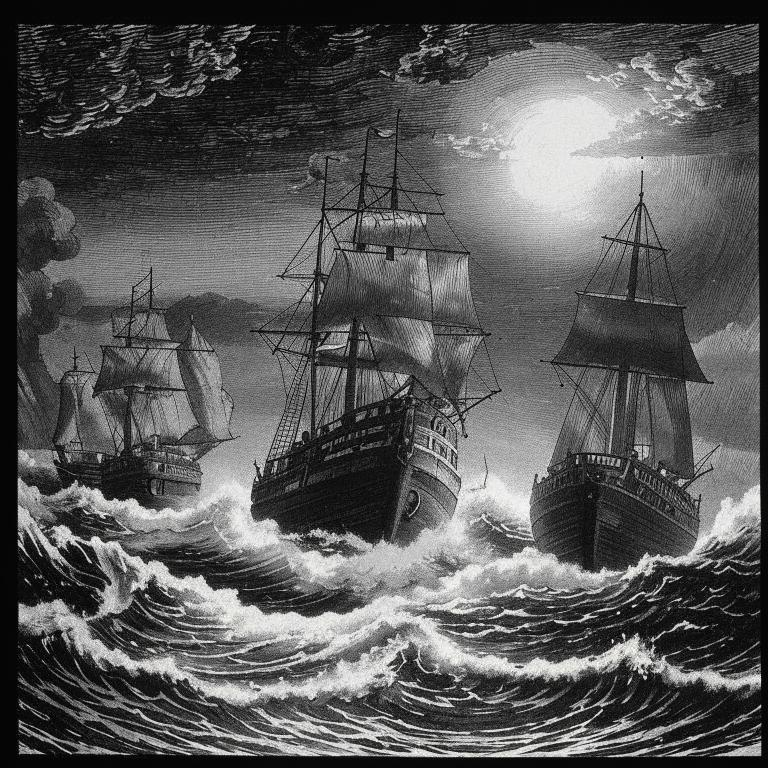
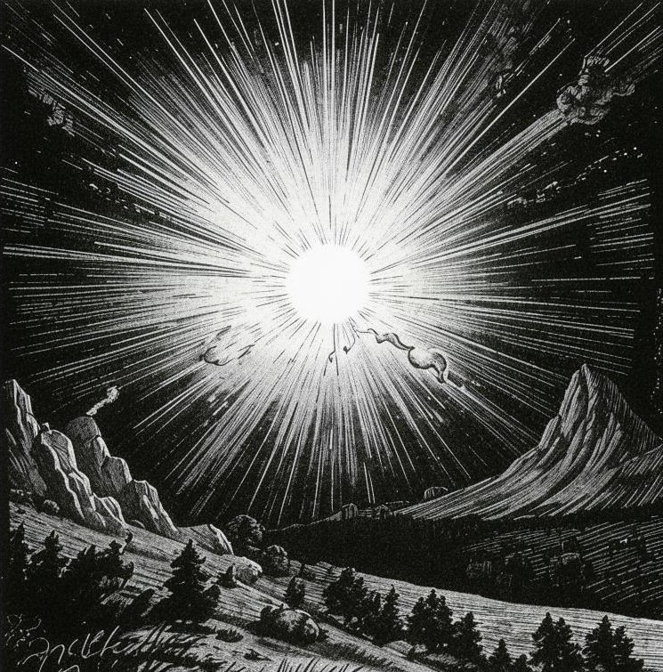

# История королевства
## Первое столетие

### До эпохи рассвета

До эпохи рассвета люди различных рас и религий жили на континенте [[Марвейд-Дра]], что лежит далеко на востоке. Земли некогда густо заросшие деревьями и обилием животных превратились в степные просторы объятые вечной войной и набегами.

Люди верят, что за горизонтом, где бушует шторм, есть лишь край мира и ничего более. 
Здесь происходят постоянные войны и небольшие внутренние конфликты. Некогда большая империя стагнирует и увядает, разрушаемая внутренними и внешними конфликтами. Ресурсы заканчиваются, а новых земель для освоения нет. 

Внутри королевства орудуют банды головорезов и мародеры. На его границах также неспокойно: с юга постоянно совершают набеги орки, хобгоблины и другие гоблоноиды под предводительством [Сандета Ужасного](https://ttg.club/bestiary/sundeth), а северные границы осадили объединение дварфов и голиафов под началом обезумевшей феи по имени [Квилит](https://ttg.club/bestiary/winter_eladrin).

Несколько ученых, входящих в золотую элиту королевства, решают собрать последнюю экспедицию в надежде, что их догадки верны и новые земли будут найдены в дали на востоке, и род людской сможет жить дальше.  Вложив огромные средства, в такое непростое время, они смогли набрать сотни людей и выкупить десятки кораблей для путешествия сквозь горизонт. 
Это были своего рода авантюристы и они прекрасно понимали что могут не то чтобы найти новую землю, но даже могут не вернуться обратно, ведь никто не знает наверняка, что лежит за бесконечным штормом у горизонта.
  
|  |  |
| ---------------------- | ---------------------- |

Путешествие было весьма трудным и опасным, оно проходило сквозь вечные шторма и грозовые бури *неспокойного моря* за что океан и получил имя [[Валлгоф]]. 
За время путешествия некоторые обезумели и считали что им кто-то шепчет, что они плывут прямиком в земли [[Кемош | Кемоша]] и их ждет лишь смерть, а не новые земли.

Так шли долгие месяцы плавания, один из кораблей затонул во время особо сильного шторма. И наконец это свершилось - шторм утих! Путешественники выбрались из шторма и увидели солнце, которого им там не хватало, а в дали у горизонта была видна земля среди этого бескрайнего океана.

### Эпоха рассвета (000-050гг)
Высадившись на континент, люди узрели первозданную красоту этих земель, но вместе с этим и ее враждебность. Новая земля получила имя [[Континент Юлхис | Юлхис]] за свой дикий и необузданный характер. Среди девственных лесов и бурлящих рек бродили троглодиты, но в сравнении с ужасами шторма это лишь пара гроз в море. 
Основав небольшую деревню на небольшом отдалении от берега, поселенцы решили назвать ее [[Руокка]], за ее необычайно большие просторы полей и равнин, богатые ягодами, мясом и различными культурами.
За дату отсчета новой жизни решили взять время прибытия и отсюда пошел нулевой год, началась *Эпоха Рассвета*.

Шли года, поселение окрепло и немного расширилось и появились первые урожаи, а также первые малыши. 
Среди подрастающих детей был ребенок, который был развит и сложен не по годам. Высок ростом, с прекрасным лицом, выдающимся умом и чуткой интуицией, а имя ему было [[Енсим Де Тюр]]. Родители назвали его в честь первопроходцев этих земель, но дали другую фамилию, чтобы скорее забыть старые просторы.

В 20 году новой эпохи, молодой Енсим своими амбициями и речами с подвиг часть поселенцев двинуться дальше, в глубины континента и расширения территории. Уйдя в глубины лесов и убив пару десятков троглодитов, началась расчистка леса для закладывания нового поселения. Место группе показалось весьма практичным: несколько рек соединялись в одну и несли в себе питьевую воду с ледников, находившихся высоко в горах. По обе стороны вдоль лесов раскинулись высокие скалы, защищающие леса от холодных ветров.  

Группа основала новое поселение и дала ему имя [[Годаланд]]. Енсим верил, что боги ходят среди людей и тем самым он почтит их добрые имена.
К 50-му году деревня Годаланд разрослась до весьма внушительных размеров и население насчитывало уже около трех сотен и оно продолжает расти. 
Также был основан небольшой город [[Фалько]] выполняющий роль перевалочного пункта между двумя поселениями

### Волшебство как наука (050-150гг)
После управления поселениями под предводительством Енсима, власть перешла к его единственному сыну [[Тайкур де Тюр | Тайкуру]] продолживший род Де Тюров.
Многие поддержали передачу бразды правление его сыну и с радостью приняли его волю. 
Так в 55 году на престол взошел [[Тайкур де Тюр]] в возрасте 19 лет.

Тайкур был весьма любознательным юношей и всегда интересовался основой мироздания и магией. В возрасте 43 лет он знакомится с [[Валаисин Тиедемис]]. Тифлингом с практически белыми, короткими волосами, который с огнем в глазах изучал магию. 
Совместными усилиями они начали изучать магию и саму ее суть, также он получает статус правой руки молодого короля.

Шли года магический потенциал заклятых друзей рос семимильными шагами, как и королевство. За минувшее время, восточнее от [[Годаланд | Годаланда]] из небольшой мастерской, размером в пару соток выросло в целую лабораторию, которая раскинулась на пару десятков гектар.
За время исследовательской деятельности было открыто множество фундаментальных заклинаний, начиная с простого огненного снаряда и заканчивая палящим лучом. 

Однажды очередной бессонной ночью в лаборатории работал Валаисин с несколькими помощниками. Мнения расходятся, либо из-за усталости, либо из-за неудачной попытки эксперимента, но произошел непомерной силы взрыв. Глубокая ночь почти на минуту сменилась на день. 
 

Король в сопровождении, прибывший на место лаборатории увидели лишь кратер и пепелище. В глубоком сожалении о своем погибшем друге Тайкур решает основать магическую академию и назвать ее в его честь. 
Таким образом в 100 г.г. была основана магическая академия [[Валаисин]]